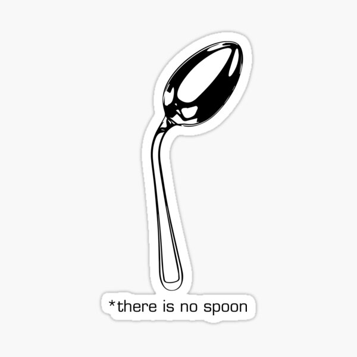

# SpoonBoy

SpoonBoy is a bundle of V2Ray and Xray subscription lists, node lists, and ready-to-use client configurations, for users in restricted networks who want a working setup without assembling one themselves.

<p align="center">
  
</p>

Languages:
[English](README/README_EN.md) ·
[فارسی (Persian)](README/README_FA.md) ·
[Kurdî (Kurdish)](README/README_KUR.md) ·
[中文 (Chinese)](README/README_ZH.md)

## Overview

SpoonBoy collects V2Ray/Xray subscription links together with default settings that work out of the box. It includes the v2rayN Windows client plus configs for sing-box and WireGuard (WARP / WoW).

The subscription pack is organised by country, by protocol (VMess, VLESS, Shadowsocks, Trojan), and by social network, and covers a wide range of ports in order to work in heavily filtered regions such as Iran and China. The lists are updated regularly as network conditions change.

The repository is usable on Windows, Linux, macOS, iOS, and Android, either as a plug-and-play setup or as raw subscription links and node lists for building a custom collector.

## Features

- Subscriptions categorised by country
- Multiple protocols: VMess, VLESS, Shadowsocks, and Trojan
- Settings tuned for access to common social apps
- A wide range of ports to work around filtering
- Multiple cores and clients: V2Ray/Xray core, sing-box configs, WireGuard (WoW/WARP), and v2rayN
- Usable on Windows, Linux, macOS, iOS, and Android
- Default settings that work without manual tuning
- Regularly refreshed subscriptions and nodes
- Support through the linked Telegram channel

## What is inside

| Resource | Description |
| --- | --- |
| [`README/SUB-LIST.md`](README/SUB-LIST.md) | The main V2Ray subscription list |
| [`README/CUNITRIES.md`](README/CUNITRIES.md) | Subscriptions sorted by country (gaming, Spotify, limited use) |
| [`README/NODES.md`](README/NODES.md) | V2Ray nodes for building your own configs or collector |
| [`README/TELEGRAM-CHANELS.md`](README/TELEGRAM-CHANELS.md) | Telegram channels broadcasting V2Ray configs |
| [`README/CLIENTS.md`](README/CLIENTS.md) | Client apps for Windows, Linux, macOS, iOS, and Android |
| `custom-xray-sub.json` / `custom-singbox-sub.json` | Custom Xray and sing-box subscription templates |
| `SingBox-Rules.json` | Routing rules for sing-box |
| `WireGaurd-WoW.conf` | WireGuard (WARP / WoW) configuration |
| `v2rayN.exe` | v2rayN Windows client |

## Getting started

### 1. Clone the repository

```bash
git clone https://github.com/morpheusadam/SpoonBoy
```

### 2. Open the client

Enter the project folder; the subscriptions and configs are ready to use. On Windows the bundled `v2rayN.exe` client can be launched directly.

### 3. Update subscriptions

Copy the links from [`README/SUB-LIST.md`](README/SUB-LIST.md), then in the client go to:

```text
SUBSCRIPTION GROUP → UPDATE SUBSCRIPTION
```

and update to pull the newest servers.

### 4. Country-specific subscriptions

For gaming, Spotify, or country-limited use, see [`README/CUNITRIES.md`](README/CUNITRIES.md).

### 5. Build your own collector

Use [`README/NODES.md`](README/NODES.md) and [`README/TELEGRAM-CHANELS.md`](README/TELEGRAM-CHANELS.md) to source nodes and channels for a custom v2raycollector.

### 6. Choose a client

Pick the app for your operating system from [`README/CLIENTS.md`](README/CLIENTS.md).

## Preview

<p align="center">
  
</p>

## Disclaimer

This project is provided for educational purposes and to support open access to information. You are responsible for complying with the laws and regulations that apply in your country.

## Contributing

Open an [issue](https://github.com/morpheusadam/SpoonBoy/issues) or submit a pull request with new subscriptions, nodes, rules, or improvements.

## License

See the repository for license details. If no license file is present, all rights are reserved by the author.

## Author

Morpheus Adam — [GitHub](https://github.com/morpheusadam) · [sam.zeonic.me](https://sam.zeonic.me) · morpheusadam95@gmail.com
